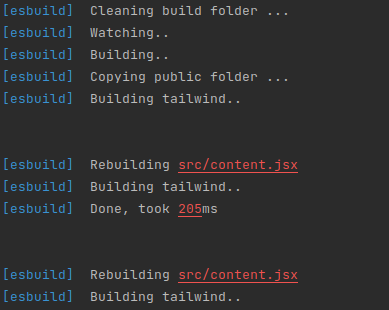

### Built chrome extension using Esbuild + React.

### Usage

- After install dependencies, run `node build.mjs --watch` or `yarn watch` run start the watch mode

- Or using `node build.mjs` or `yarn build` to build the extension